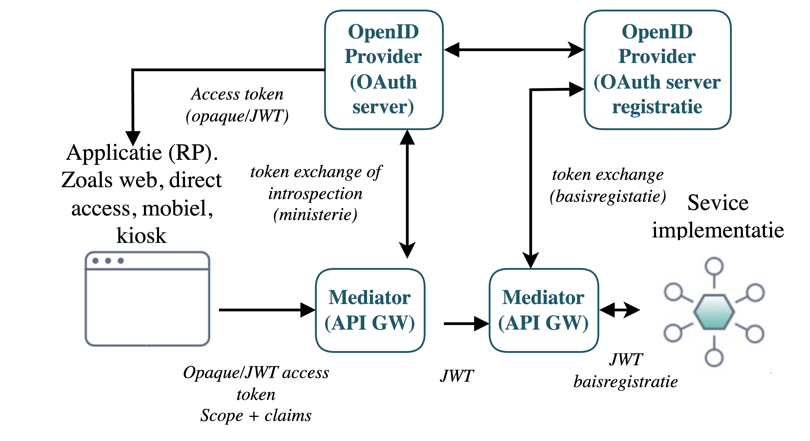

# OAuth - Advanced security

> Concept beschrijving dd 01-11-2024 - door Stas Mironov

## Inleiding

## Use-cases extra security features

### 1. Opaque tokens
Toevoegen aan Inleidend document extra security optie.

Met name een privacy aspect dat je geen persoonsgegevens kan lekken in een opaque token

vooral opnemen als best practice in inleidend document oauth

dit is geen specificatie of RFC maar een optionele functie

#### Introductie

De nieuwe versie van het OAuth NL profiel voegt onder meer de mogelijkheid voor het gebruik van opaque tokens als optie bij token response, binnen het profiel. Het is belangrijk om te benadrukken dat dit is geen specificatie of RFC is, maar een optionele functie.
Zie ook v1.1.0-rc.2 op :  https://logius-standaarden.github.io/OAuth-NL-profiel/ 

Dit is toegevoegd als best practice, op basis van het rapport van Gartner "Architect a Modern API Access Control Strategy" ID G00723547, waar het sterk is aangeraden om het externe OAuth access_token token in te wisselen voor een intern access_token. Het externe token kan een JWT token zijn met weinig/geen claims of een opaque token. Aangezien het access_token niet gevalideerd hoort te worden door de client (RP) kan het even goed een opaque token zijn. Gartner raadt gebruik van opaque tokens aan om privacyoverwegingen.

#### Context / wat zijn opaque tokens?

In de context van OAuth wil je als client zijnde vaak een resource aanspreken. Als je volledig door de authorisatie komt krijg je een token mee als bewijs van jou toegang tot de resource - deze access token, vaak een jwt (JSON Web Token), heeft inherent (gevoelige) informatie in zich verstopt zonder enige meerwaarde voor de client. Hier komen opaque tokens aan bod.

Opaque token is een type access token that do not reveal any information about the user or the token itself. Unlike JWTs (JSON Web Tokens), which encode information and can be decoded by clients, opaque tokens are essentially random strings that serve as references to information stored on the server.
Opaque tokens is een type toegangstoken welke geen informatie onthult over de gebruiker of het token zelf. In wezen zijn het willekeurige strings die dienen als referenties naar informatie die op de (OAuth/Open ID provider) server is opgeslagen.

#### Voorbeeld architectuur

Hierboven zien we een voorbeeld architectuur/flow met de nodige building blocks om de werking van opaque tokens aan te duiden. Zoals we al weten gaat het bij OAuth om het scheiden van de Authorization Server van de Resource Server en deze onafhankelijk maken van de gebruikte client. 
We zien dat de access tokens aan de client kant (tot en met de Mediator/API gateway) als opaque tokens kunnen worden geimplementeerd. De bijbehorende OAuth server moet deze kunnen vertalen naar de bijbehordende JWT's en deze zal via de API gateways worden meegestuurd naar de service, die in dit geval onder een registratie valt. De service kan dan gewoon geimplementeerd worden met JWT's in mind.

> _Toevoegen verschil OAuth server aan de registratie kant?_

#### Voordelen van Opaque Tokens
- ##### Minder privacygevoelig
    Omdat opaque tokens geen gebruikers informatie bevatte, is er minder kans op lekkage van gevoelige gegevens. 

- ##### Beperkte risico's bij diefstal
    Daarnaast maakt het ook andere geimplementeerde mechanismen aan de server kant veiliger. Denk bijvoorbeeld aan refresh tokens - ook al zou er een token gecompromitteerd zijn, het is dan voor de boosdoener nog steeds niet af te leiden wat voor eigenschappen deze token bezit en daarmee de resources the misbruiken.

#### Implementatie overwegingen

- ##### Token Generatie
    Bij het genereren van opaque tokens is het cruciaal om een veilige random generators te gebruiken. Hier bestaan al liraries en frameworks voor.

- ##### Token Opslag
    De server moet een veilige opslag van tokens en hun bijbehorende metadata (bijv. gebruikers-ID, vervaltijd, scopes) bijhouden. Denk aan een database of in-memory opslag, waarbij de toegang goed moet worden beschermd.

- ##### Token Validatie
    Bij ontvangst van een nieuwe request moet de server vooralsnog de validatieprocessen voor tokens implementeren. Denk hierbij aan het controleren van het bestaan en de geldigheid van een token; verifiëren van de bijbehorende gebruikerspermissies; checken op vervaldatum etc.

## Referenties

[Link naar de lijst van verplichte standaarden]

https://forumstandaardisatie.nl/open-standaarden/verplicht

[link naar de standaard]

https://forumstandaardisatie.nl/open-standaarden/verplicht#:~:text=NL%20GOV%20Assurance%20profile%20for%20OAuth%202.0

[link naar de logius standaard]

https://publicatie.centrumvoorstandaarden.nl/api/oauth/

RFC 6749: The OAuth 2.0 Authorization Framework
OWASP: JSON Web Tokens (JWT) Cheat Sheet
NIST Special Publication 800-63: Digital Identity Guidelines
